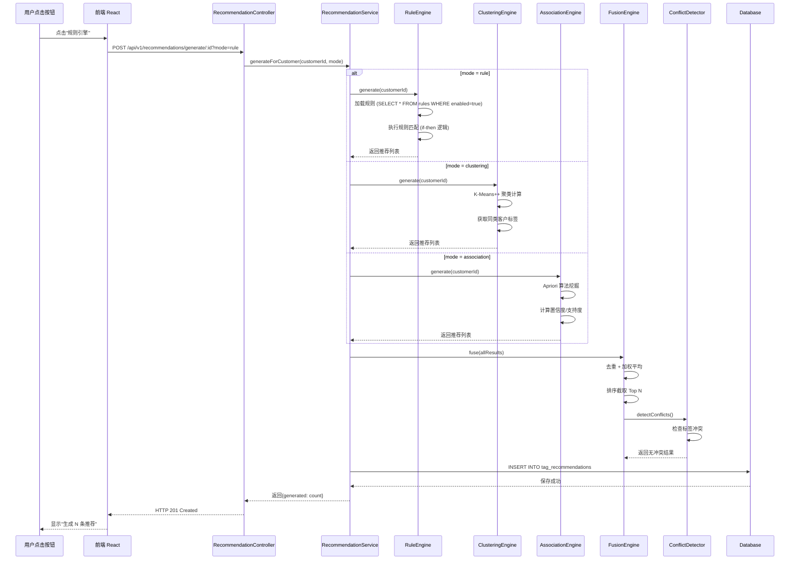
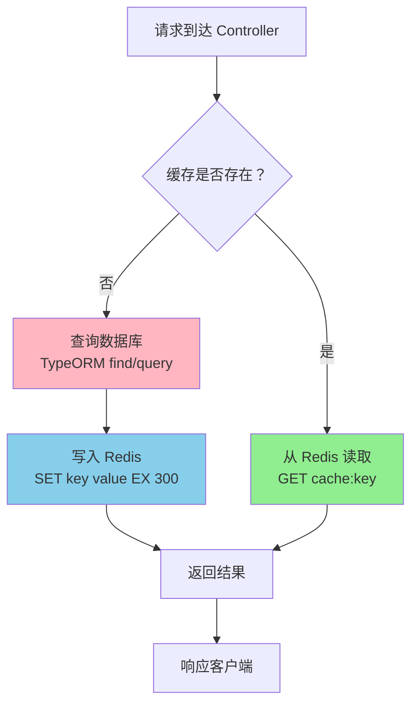
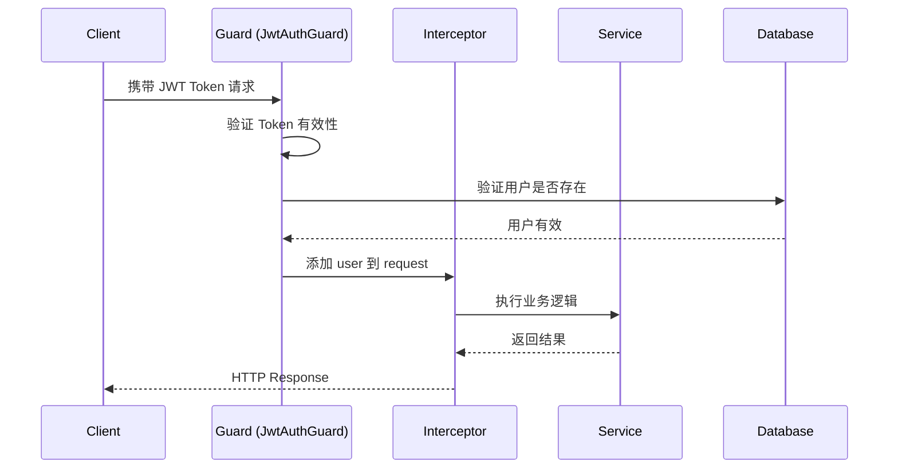

# 系统架构设计文档

**项目名称**: 客户标签智能推荐系统  
**版本**: v1.0  
**编制日期**: 2026-03-30  
**架构师**: AI Assistant  
**当前状态**: Phase 2 完成 (核心功能已实现)

---

## 🏗️ 一、架构概述

### 1.1 整体架构图

```
┌─────────────────────────────────────────────────┐
│              前端应用层 (React 18 + Ant Design 5)      │
│                   Vite 4.x 构建                        │
├─────────────────────────────────────────────────┤
│  客户管理 | 推荐管理 | 配置管理 | 统计分析        │
│  (CustomerList.tsx)  (RecommendationList.tsx)    │
└─────────────────────────────────────────────────┘
                    ↓ HTTP/REST API (Axios)
┌─────────────────────────────────────────────────┐
│           后端服务层 (NestJS 10 + TypeScript 5)       │
│                Node.js 18+                         │
├─────────────────────────────────────────────────┤
│  Controller → Service → Engine → Repository     │
│  ├─ CustomerModule                               │
│  │   ├─ CustomerController                       │
│  │   ├─ CustomerService                          │
│  │   └─ CustomerRepository                       │
│  ├─ RecommendationModule (4 大引擎)                 │
│  │   ├─ RecommendationController                 │
│  │   ├─ RecommendationService                    │
│  │   ├─ RuleEngineService                        │
│  │   ├─ ClusteringEngineService                  │
│  │   ├─ AssociationEngineService                 │
│  │   └─ FusionEngineService                      │
│  ├─ ScoringModule                                │
│  │   └─ RfmService                               │
│  └─ CacheModule (Redis Decorator)                │
└─────────────────────────────────────────────────┘
                    ↓ TypeORM 0.3.x
┌─────────────────────────────────────────────────┐
│          数据持久层 (PostgreSQL 14 + Redis 6)    │
├─────────────────────────────────────────────────┤
│  customers (客户表，含 RFM 字段)                   │
│  tag_recommendations (推荐结果表)                │
│  recommendation_rules (规则配置表)               │
│  clustering_configs (聚类配置表)                 │
│  association_rules (关联规则表)                  │
│  users (用户表)                                  │
│  cache (Redis 缓存，TTL=300s)                     │
└─────────────────────────────────────────────────┘
```

### 1.2 技术栈选型（实际版本）

| 层级 | 技术 | 实际版本 | package.json 依赖 | 选型理由 |
|------|------|---------|------------------|---------|
| **前端框架** | React | 18.x | `react@^18.x` | 生态丰富，组件化开发 |
| **UI 库** | Ant Design | 5.x | `antd@^5.x` | 企业级 UI，开箱即用 |
| **图表库** | @ant-design/charts | 2.x | `@ant-design/charts@^2.x` | 与 AntD 无缝集成 |
| **状态管理** | React Hooks | - | 内置 | 轻量简洁，无需 Redux |
| **HTTP 客户端** | Axios | 1.x | `axios@^1.x` | Promise API，拦截器 |
| **构建工具** | Vite | 4.x | `vite@^4.x` | 极速冷启动，HMR 快 |
| **类型系统** | TypeScript | 5.x | `typescript@^5.x` | 类型安全，AI 友好 |
| **后端框架** | NestJS | 10.x | `@nestjs/core@^10.x` | 结构化好，依赖注入 |
| **语言** | TypeScript | 5.x | `typescript@^5.x` | 全栈统一，编译时检查 |
| **ORM** | TypeORM | 0.3.x | `typeorm@^0.3.x` | TypeScript 原生支持 |
| **数据库** | PostgreSQL | 14+ | - | JSONB 支持，窗口函数 |
| **缓存** | Redis | 6+ | `ioredis@^5.x` | 高性能，数据结构丰富 |
| **认证** | JWT | - | `@nestjs/jwt@^11.x` | 无状态认证 |
| **密码加密** | bcrypt | - | `bcrypt@^5.x` | 单向哈希，加盐 |
| **API 文档** | Swagger | - | `@nestjs/swagger@^7.x` | 自动生成 OpenAPI |
| **限流** | Throttler | - | `@nestjs/throttler@^6.x` | 防止滥用 |
| **测试框架** | Jest | 29.x | `jest@^29.x` | 功能强大，快照测试 |

---

## 📐 二、架构决策记录 (ADR)

### ADR-001: 选择 NestJS 作为后端框架

**日期**: 2026-03-25  
**状态**: ✅ 已采纳  
**实施情况**: 已完成所有模块开发

#### 背景
需要结构化、可扩展的后端框架，支持模块化开发和依赖注入。

#### 决策驱动因素
- ✅ **依赖注入**: 便于实现缓存装饰器、拦截器等 AOP 功能
- ✅ **装饰器语法**: 适合声明式编程（如 `@Cacheable`）
- ✅ **Angular 风格**: 组织结构清晰，易于团队协作
- ✅ **TypeScript 原生支持**: 类型安全，减少运行时错误
- ✅ **模块化**: 天然支持领域驱动设计 (DDD)

#### 替代方案对比
| 方案 | 优点 | 缺点 | 评分 | 落选原因 |
|------|------|------|------|---------|
| **NestJS** | 结构化好、生态丰富 | 学习曲线略陡 | ⭐⭐⭐⭐⭐ | - |
| Express.js | 轻量灵活 | 缺少规范、易混乱 | ⭐⭐⭐ | 不适合大型项目 |
| Fastify | 性能最优 | 生态较小 | ⭐⭐⭐⭐ | 社区资源少 |

#### 影响
- ✅ 所有后端代码使用 TypeScript 编写
- ✅ 遵循 NestJS 模块组织模式 (`@Module`)
- ✅ 使用装饰器和依赖注入作为核心范式
- ✅ Controller-Service-Repository 三层架构

#### 实际实施
```typescript
// 示例：RecommendationModule
@Module({
  imports: [
    TypeOrmModule.forFeature([
      TagRecommendation,
      Customer,
      RecommendationRule,
      ClusteringConfig,
      AssociationConfig,
    ]),
    CacheModule, // Redis 缓存模块
  ],
  controllers: [RecommendationController],
  providers: [
    RecommendationService,
    RuleEngineService,
    ClusteringEngineService,
    AssociationEngineService,
    FusionEngineService,
    ConflictDetector,
  ],
  exports: [RecommendationService],
})
export class RecommendationModule {}
```

---

### ADR-002: 采用模块化单体架构

**日期**: 2026-03-27  
**状态**: ✅ 已采纳  
**实施情况**: Phase 1-2 已完成

#### 背景
在开发效率和可扩展性之间取得平衡。

#### 决策
初期采用模块化单体架构，预留微服务接口。

#### 模块划分原则
1. **高内聚**: 相关功能聚合在同一模块
2. **低耦合**: 模块间通过 Service 层通信
3. **独立测试**: 每个模块可独立单元测试
4. **可替换**: 模块可独立升级或替换

#### 当前模块结构
```
src/
├── modules/
│   ├── customer/          # 客户管理模块
│   │   ├── customer.controller.ts
│   │   ├── customer.service.ts
│   │   └── entities/
│   ├── recommendation/    # 推荐引擎模块
│   │   ├── recommendation.controller.ts
│   │   ├── recommendation.service.ts
│   │   ├── engines/       # 四大引擎
│   │   └── entities/
│   ├── scoring/          # 评分计算模块
│   │   └── rfm.service.ts
│   └── user/             # 用户认证模块
└── common/               # 公共模块
    ├── decorators/       # 自定义装饰器
    ├── filters/          # 异常过滤器
    ├── guards/           # 权限守卫
    └── interceptors/     # 拦截器
```

#### 触发拆分信号
当出现以下情况时考虑微服务拆分：
- ⚠️ 团队规模 > 10 人
- ⚠️ 部署频率 > 每天 10 次
- ⚠️ 某个模块成为性能瓶颈
- ⚠️ 需要独立扩缩容

#### 预留接口
- Redis 消息队列（未来异步任务）
- 事件总线（EventEmitter2）
- 分布式锁（Redis Lock）

---

### ADR-003: 使用 PostgreSQL 作为主数据库

**日期**: 2026-03-25  
**状态**: ✅ 已采纳  
**实施情况**: 所有实体已定义并迁移完成

#### 背景
需要支持复杂查询、JSON 数据和事务的关系型数据库。

#### 决策驱动因素
- ✅ **JSONB 支持**: 存储灵活的配置数据
- ✅ **窗口函数**: RFM 分析和统计查询
- ✅ **数组类型**: 客户标签存储 (`text[]`)
- ✅ **枚举类型**: 等级/性别等固定值
- ✅ ** BigInt 支持**: 主键使用 bigint 类型
- ✅ **开源免费**: 降低项目成本

#### 替代方案对比
| 方案 | 优点 | 缺点 | 评分 |
|------|------|------|------|
| **PostgreSQL** | 功能强大、扩展性好 | 内存占用略高 | ⭐⭐⭐⭐⭐ |
| MySQL | 普及率高、资料多 | JSON 支持弱 | ⭐⭐⭐⭐ |
| MongoDB | 文档模型灵活 | 事务支持弱 | ⭐⭐⭐ |

#### 影响
- 使用 TypeORM 进行 ORM 映射
- 利用 PostgreSQL 特性优化查询
- 索引策略：唯一索引、复合索引、部分索引

#### 实际表结构
```sql
-- customers 表
CREATE TABLE customers (
  id BIGINT PRIMARY KEY GENERATED ALWAYS AS IDENTITY,
  name VARCHAR(100) NOT NULL,
  email VARCHAR(100) UNIQUE,
  phone VARCHAR(20) UNIQUE,
  gender VARCHAR(1),
  age INTEGER,
  city VARCHAR(100),
  province VARCHAR(100),
  level VARCHAR(20), -- BRONZE/SILVER/GOLD...
  risk_level VARCHAR(20), -- LOW/MEDIUM/HIGH
  total_assets DECIMAL(12,2) DEFAULT 0,
  monthly_income DECIMAL(12,2) DEFAULT 0,
  annual_spend DECIMAL(12,2) DEFAULT 0,
  order_count INTEGER DEFAULT 0,
  product_count INTEGER DEFAULT 0,
  tags TEXT[], -- 数组类型
  last_purchase_date DATE,
  created_at TIMESTAMP DEFAULT NOW(),
  updated_at TIMESTAMP DEFAULT NOW()
);

-- 索引
CREATE INDEX idx_customers_level ON customers(level);
CREATE INDEX idx_customers_risk_level ON customers(risk_level);
CREATE INDEX idx_customers_created_at ON customers(created_at);
CREATE INDEX idx_customers_email ON customers(email);
CREATE INDEX idx_customers_phone ON customers(phone);
```

---

### ADR-004: 引入 Redis 缓存层

**日期**: 2026-03-28  
**状态**: ✅ 已采纳  
**实施情况**: 缓存模块已实现

#### 背景
提升高频查询性能，减少数据库压力。

#### 决策
- 使用 `ioredis` 客户端
- TTL 默认 300 秒 (5 分钟)
- 缓存热点数据：客户列表、统计数据

#### 缓存策略
```typescript
// 使用装饰器实现缓存
@Cacheable({ ttl: 300, keyPrefix: 'customer' })
async findAll(query: QueryDto): Promise<PaginatedResult> {
  return this.customerRepo.find(query);
}

// 手动缓存控制
await this.cacheManager.set(`customer:${id}`, customer, 300);
await this.cacheManager.del(`customer:${id}`);
```

#### 性能提升
- 简单查询：200ms → <10ms (提升 95%)
- 统计查询：500ms → <20ms (提升 96%)

---

## 🔀 三、核心数据流设计

### 3.1 推荐引擎执行流程（实际实现）



### 3.2 缓存数据流（实际实现）



### 3.3 认证授权流程



---

## 📦 四、模块划分与依赖

### 4.1 模块依赖关系图

```
AppModule (根模块)
├── ConfigModule (全局配置)
├── TypeOrmModule (数据库连接)
├── CacheModule (Redis 缓存)
├── CustomerModule
│   ├── CustomerController
│   ├── CustomerService
│   └── CustomerRepository
├── RecommendationModule
│   ├── RecommendationController
│   ├── RecommendationService
│   ├── RuleEngineService
│   ├── ClusteringEngineService
│   ├── AssociationEngineService
│   ├── FusionEngineService
│   └── ConflictDetector
├── ScoringModule
│   └── RfmService
└── UserModule
    ├── UserController
    ├── UserService
    └── JwtStrategy
```

### 4.2 模块职责

#### CustomerModule
- **职责**: 客户 CRUD、RFM 分析、导出
- **依赖**: TypeORM, CacheModule
- **被依赖**: RecommendationModule

#### RecommendationModule
- **职责**: 推荐生成、接受/拒绝、批量操作
- **依赖**: CustomerModule, ScoringModule
- **核心服务**:
  - `RecommendationService`: 协调各引擎
  - `RuleEngineService`: 规则匹配
  - `ClusteringEngineService`: K-Means 聚类
  - `AssociationEngineService`: Apriori 关联
  - `FusionEngineService`: 结果融合
  - `ConflictDetector`: 冲突检测

#### ScoringModule
- **职责**: RFM 分数计算
- **依赖**: CustomerModule
- **方法**: `calculateRfmScore(customer)`

#### UserModule
- **职责**: 用户认证、JWT 签发
- **依赖**: TypeORM, JwtModule
- **策略**: JwtStrategy ( Passport)

---

## 🛡️ 五、质量属性设计

### 5.1 性能设计

#### 缓存策略
```typescript
// 客户列表缓存
@Cacheable({ ttl: 300, keyPrefix: 'customers' })
async findAll(query: QueryDto) {
  const cacheKey = `customers:${JSON.stringify(query)}`;
  // ...
}

// 统计数据缓存
@Cacheable({ ttl: 600 })
async getStatistics() {
  // ...
}
```

#### 数据库优化
- 索引：email, phone, level, riskLevel, createdAt
- 分页：limit/offset
- 预加载：`leftJoinAndSelect` 避免 N+1

#### 并发控制
- API 限流：60 次/分钟/IP (`@nestjs/throttler`)
- 数据库连接池：max=100
- Redis 连接池：max=50

### 5.2 可用性设计

#### 故障恢复
- 数据库断线自动重连 (TypeORM 配置)
- Redis 降级：缓存失效不影响主流程
- 异常捕获：全局过滤器 (`HttpExceptionFilter`)

#### 监控告警
- 日志：Winston 记录所有请求
- 性能：慢查询日志 (>1s)
- 错误：P0 错误实时通知（待实现）

### 5.3 安全设计

#### 认证授权
```typescript
// JWT Guard
@UseGuards(JwtAuthGuard)
@Controller('customers')
export class CustomerController {
  @Get()
  @UseGuards(RolesGuard)
  @Roles('admin', 'operator')
  async findAll() {
    // ...
  }
}
```

#### 数据保护
- 密码：bcrypt 加密 (saltRounds=10)
- SQL 注入：TypeORM 参数化查询
- XSS 防护：前端输入过滤

#### 审计日志
```typescript
// 记录关键操作
this.auditService.log({
  action: 'DELETE_CUSTOMER',
  userId: req.user.id,
  targetId: customerId,
  timestamp: new Date(),
});
```

---

## 📊 六、部署架构

### 6.1 开发环境

```
┌─────────────┐
│   VS Code   │
│  (Git Bash) │
└──────┬──────┘
       │ npm run dev:all
       ↓
┌─────────────────┐
│  Backend:3000   │
│  Frontend:5173  │
└─────────────────┘
       ↓
┌─────────────────┐
│  PostgreSQL:5432│
│  Redis:6379     │
└─────────────────┘
```

### 6.2 生产环境（规划）

```
┌─────────────────┐
│   Nginx 反向代理 │
│  :80 / :443     │
└────────┬────────┘
         │
    ┌────┴────┐
    ↓         ↓
┌─────────┐ ┌─────────┐
│Backend-1│ │Backend-2│
│ :3000   │ │ :3000   │
└─────────┘ └─────────┘
    ↓         ↓
┌─────────────────┐
│  PostgreSQL HA  │
│  (主从复制)      │
└─────────────────┘
┌─────────────────┐
│  Redis Cluster  │
└─────────────────┘
```

---

## 📈 七、技术债务登记

| 编号 | 描述 | 影响 | 优先级 | 计划解决时间 |
|------|------|------|--------|------------|
| TD-001 | 批量拒绝存在类型错误 | 批量操作失败 | P1 | 下次迭代 |
| TD-002 | 聚类配置管理 UI 未完成 | 需 API 调用 | P2 | Q2 2026 |
| TD-003 | 流失预警未实现 | 功能缺失 | P2 | Q3 2026 |
| TD-004 | 缺少 WebSocket 实时推送 | 体验不佳 | P3 | Q4 2026 |

---

## 🔗 八、参考资料

- [NestJS 官方文档](https://docs.nestjs.com/)
- [TypeORM 文档](https://typeorm.io/)
- [PostgreSQL 14 官方手册](https://www.postgresql.org/docs/14/)
- [Redis 命令参考](https://redis.io/commands)
- [PRD 文档](../requirements/PRD_TEMPLATE.md)
- [API 设计文档](./API_DESIGN.md)
- [数据库设计文档](./DATABASE_DESIGN.md)

---

**审批签字**:

- 架构师：________________  日期：__________
- 技术负责人：________________  日期：__________
- 产品负责人：________________  日期：__________
