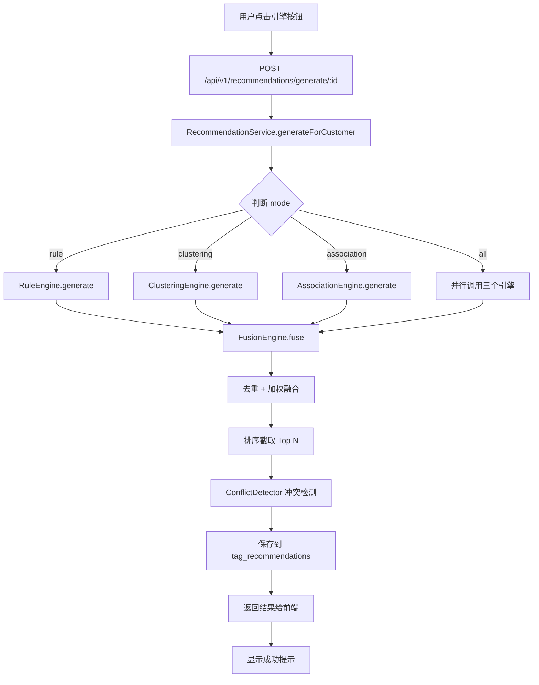
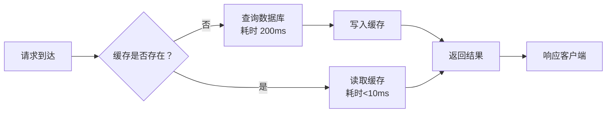

# 系统架构设计文档

**项目名称**: 客户标签推荐系统  
**版本**: v1.0  
**编制日期**: 2026-03-30  
**架构师**: [待填写]

---

## 🏗️ 一、架构概述

### 1.1 整体架构图

```
┌─────────────────────────────────────────────────┐
│              前端应用层 (React + Ant Design)      │
├─────────────────────────────────────────────────┤
│  客户管理 | 推荐管理 | 配置管理 | 统计分析        │
└─────────────────────────────────────────────────┘
                    ↓ HTTP/REST API
┌─────────────────────────────────────────────────┐
│           后端服务层 (NestJS + TypeScript)       │
├─────────────────────────────────────────────────┤
│  Controller → Service → Engine → Repository     │
│  ├─ CustomerModule                              │
│  ├─ RecommendationModule (4 大引擎)               │
│  ├─ UserModule                                  │
│  └─ CacheModule                                 │
└─────────────────────────────────────────────────┘
                    ↓ TypeORM
┌─────────────────────────────────────────────────┐
│          数据持久层 (PostgreSQL 14 + Redis 6)    │
├─────────────────────────────────────────────────┤
│  customers | tag_recommendations | rules        │
│  clustering_configs | association_rules         │
└─────────────────────────────────────────────────┘
```

### 1.2 技术栈选型

| 层级 | 技术 | 版本 | 选型理由 |
|------|------|------|---------|
| **前端框架** | React | 18.x | 生态丰富，组件化开发 |
| **UI 库** | Ant Design | 5.x | 企业级 UI，开箱即用 |
| **状态管理** | React Hooks | - | 轻量简洁，无需 Redux |
| **构建工具** | Vite | 4.x | 极速冷启动，HMR 快 |
| **后端框架** | NestJS | 10.x | 结构化好，依赖注入 |
| **语言** | TypeScript | 5.x | 类型安全，AI 友好 |
| **数据库** | PostgreSQL | 14+ | JSONB 支持，窗口函数 |
| **缓存** | Redis | 6+ | 高性能，数据结构丰富 |
| **ORM** | TypeORM | 0.3.x | TypeScript 原生支持 |

---

## 📐 二、架构决策记录 (ADR)

### ADR-001: 选择 NestJS 作为后端框架

**日期**: 2026-03-25  
**状态**: 已采纳

#### 背景
需要结构化、可扩展的后端框架，支持模块化开发和依赖注入。

#### 决策驱动因素
- ✅ **依赖注入**: 便于实现缓存装饰器、拦截器等 AOP 功能
- ✅ **装饰器语法**: 适合声明式编程（如 `@Cacheable`）
- ✅ **Angular 风格**: 组织结构清晰，易于团队协作
- ✅ **TypeScript 原生支持**: 类型安全，减少运行时错误

#### 替代方案对比
| 方案 | 优点 | 缺点 | 评分 |
|------|------|------|------|
| **NestJS** | 结构化好、生态丰富 | 学习曲线略陡 | ⭐⭐⭐⭐⭐ |
| Express.js | 轻量灵活 | 缺少规范、易混乱 | ⭐⭐⭐ |
| Fastify | 性能最优 | 生态较小 | ⭐⭐⭐⭐ |

#### 影响
- 所有后端代码使用 TypeScript 编写
- 遵循 NestJS 模块组织模式
- 使用装饰器和依赖注入作为核心范式

---

### ADR-002: 采用模块化单体架构

**日期**: 2026-03-27  
**状态**: 已采纳

#### 背景
在开发效率和可扩展性之间取得平衡。

#### 决策
初期采用模块化单体架构，预留微服务接口。

#### 触发拆分信号
当出现以下情况时考虑微服务拆分：
- 团队规模 > 10 人
- 部署频率 > 每天 10 次
- 某个模块成为性能瓶颈
- 需要独立扩缩容

---

## 🔀 三、核心数据流设计

### 3.1 推荐引擎执行流程



### 3.2 缓存数据流



---

## 📦 四、模块划分

### 4.1 模块依赖关系

```
AppModule
├── CustomerModule
│   ├── entities: Customer
│   ├── dto: CreateCustomerDto, UpdateCustomerDto
│   ├── controller: CustomerController
│   └── service: CustomerService
│
├── RecommendationModule
│   ├── engines: Rule/Clustering/Association/Fusion
│   ├── controller: RecommendationController
│   └── service: RecommendationService
│
├── CacheModule
│   ├── decorator: @Cacheable, @CacheEvict
│   ├── interceptor: CacheInterceptor
│   └── service: CacheService
│
└── InfrastructureModule
    ├── redis: RedisService
    ├── database: TypeOrmConfig
    └── queue: BullQueue
```

### 4.2 模块职责边界

| 模块 | 职责 | 不包含的内容 |
|------|------|------------|
| **CustomerModule** | 客户 CRUD、RFM 分析、批量操作 | 推荐逻辑、缓存策略 |
| **RecommendationModule** | 四大引擎实现、结果融合 | 具体业务规则定义 |
| **CacheModule** | 通用缓存服务、装饰器 | 业务数据本身 |
| **InfrastructureModule** | 基础设施配置 | 业务逻辑 |

---

## 🔒 五、安全架构

### 5.1 认证授权流程

```
客户端 → JWT Token → API Gateway → JwtAuthGuard → RolesGuard → Controller
```

### 5.2 权限模型 (RBAC)

```
Role: ADMIN
- 所有 CRUD 权限
- 配置管理
- 用户管理

Role: OPERATOR
- 客户 CRUD
- 触发推荐引擎
- 接受/拒绝推荐

Role: VIEWER
- 只读权限
- 查看统计报表
```

---

## ⚡ 六、性能优化策略

### 6.1 缓存策略

| 数据类型 | 缓存策略 | TTL |
|---------|---------|-----|
| 客户详情 | @Cacheable | 1 小时 |
| 统计报表 | getOrSet 模式 | 24 小时 |
| 配置信息 | 预加载 + 手动失效 | 永不过期 |
| 会话 Token | Redis Set | 2 小时 |

### 6.2 数据库优化

- **索引**: 为 level、city、totalAssets 创建索引
- **分页**: 强制分页，limit <= 100
- **JOIN**: 使用关联查询避免 N+1 问题
- **慢查询**: 开启 pg_stat_statements 监控

---

## 📊 七、部署架构

### 7.1 环境规划

| 环境 | 用途 | 域名 | 访问方式 |
|------|------|------|---------|
| **开发** | 本地开发 | localhost:3000 | 直连 |
| **测试** | 集成测试 | test.example.com | VPN |
| **预发** | 上线前验证 | staging.example.com | VPN |
| **生产** | 正式环境 | app.example.com | 公网 |

### 7.2 资源配置（生产环境）

| 资源 | 配置 | 数量 | 说明 |
|------|------|------|------|
| **应用服务器** | 4 核 8GB | 2 台 | PM2 Cluster 模式 |
| **数据库** | 4 核 16GB | 1 主 1 从 | PostgreSQL 14 |
| **缓存** | 2 核 4GB | 1 主 1 从 | Redis 6 |
| **负载均衡** | Nginx | 1 台 | 反向代理 + SSL |

---

## 🔄 八、演进路线

### Phase 1 (v1.0): 模块化单体 ✅
- 清晰的模块边界
- 依赖注入解耦
- 统一的缓存层

### Phase 2 (v2.0): 服务化拆分 ⏳
- 独立的推荐服务
- 独立的客户数据服务
- 通过 gRPC/RPC 通信

### Phase 3 (v3.0): 微服务架构 🎯
- 完整的服务网格
- 容器化部署 (K8s)
- 自动扩缩容

---

## 📚 九、参考文档

- [推荐引擎架构详解](../RECOMMENDATION_ENGINES_ARCHITECTURE.md)
- [API 接口设计](./API_DESIGN.md)
- [数据库设计](./DATABASE_DESIGN.md)
- [设计规范](../standards/DESIGN_GUIDELINES.md)

---

**文档版本**: v1.0  
**编制人**: [待填写]  
**审核人**: [待填写]  
**批准人**: [待填写]

**© 2026 客户标签推荐系统项目组 版权所有**
