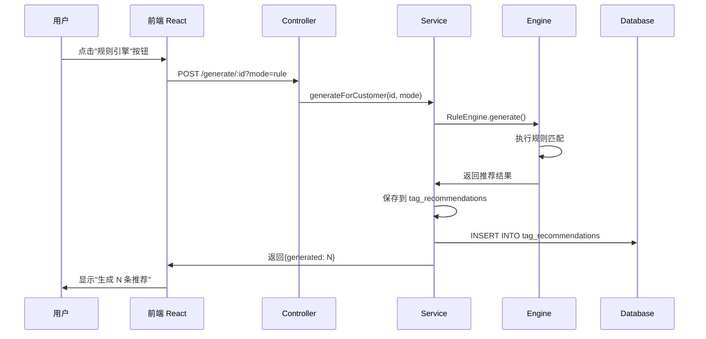
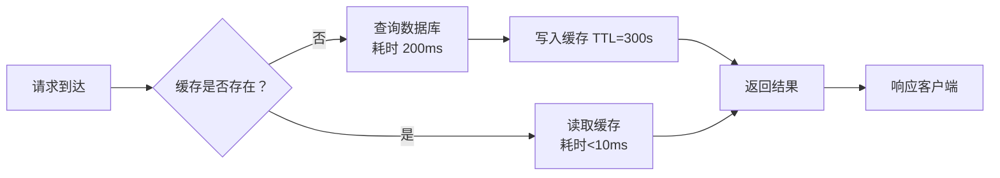

# 产品需求文档 (PRD)

**项目名称**: 客户标签智能推荐系统  
**版本**: v1.0  
**编制日期**: 2026-03-30  
**产品负责人**: 产品经理（待任命）  
**技术负责人**: AI Assistant  
**当前状态**: 开发中 (Phase 2 完成)

---

## 📋 一、项目概述

### 1.1 项目背景

随着企业客户数据量激增，面临以下痛点：
- **数据分散**: 客户信息散落在多个系统，缺乏统一视图
- **营销粗放**: 无法精准识别客户特征，营销转化率低
- **依赖经验**: 客户分群和推荐主要靠人工经验，缺乏数据支撑
- **响应缓慢**: 市场变化快，传统数据分析周期长，无法及时响应

**业务驱动因素**:
- 金融行业客户数量突破 10 万+，需要智能化管理
- 营销成本逐年上升，急需提升转化率
- 竞争对手已部署 AI 推荐系统，需保持竞争力

### 1.2 产品目标

构建一套智能客户标签推荐系统，实现：
- ✅ **统一客户视图**: 整合客户数据，建立 360° 画像
- ✅ **智能推荐**: 基于规则/聚类/关联等多引擎自动推荐标签
- ✅ **精准营销**: 提升营销转化率 30%+
- ✅ **降本增效**: 减少人工分析时间 80%+

**成功指标 (KPI)**:
- 推荐接受率 ≥ 65%
- 营销转化率提升 ≥ 30%
- 客户分析时间减少 ≥ 80%
- 系统可用性 ≥ 99.5%

### 1.3 目标用户

| 用户角色 | 典型场景 | 核心诉求 | 优先级 |
|---------|---------|---------|--------|
| **销售经理** | 查看 VIP 客户列表，分配跟进任务 | 快速识别高价值客户 | P0 |
| **运营人员** | 触发推荐引擎，获取营销策略 | 准确推荐，可解释性强 | P0 |
| **数据分析师** | 配置规则引擎，调整聚类参数 | 灵活配置，可视化分析 | P1 |
| **系统管理员** | 用户权限管理，系统监控 | 安全稳定，易维护 | P2 |

---

## 🎯 二、功能需求

### 2.1 功能架构

```
┌─────────────────────────────────────────┐
│           前端应用层 (React 18 + Ant Design 5)            │
├─────────────────────────────────────────┤
│ 客户管理 | 推荐管理 | 配置管理 | 统计分析 │
└─────────────────────────────────────────┘
              ↓ REST API
┌─────────────────────────────────────────┐
│          API 网关层 (NestJS 10 + TypeScript 5)             │
├─────────────────────────────────────────┤
│   Controller → Service → Engine         │
│   ├─ CustomerModule                      │
│   ├─ RecommendationModule (4 大引擎)       │
│   ├─ ScoringModule                        │
│   └─ CacheModule (Redis)                 │
└─────────────────────────────────────────┘
              ↓ TypeORM 0.3
┌─────────────────────────────────────────┐
│          数据持久层 (PostgreSQL 14 + Redis 6)          │
├─────────────────────────────────────────┤
│ customers | tag_recommendations | configs   │
└─────────────────────────────────────────┘
```

### 2.2 功能清单

#### F1: 客户管理模块 (CustomerModule)

| 功能编号 | 功能名称 | 优先级 | 描述 | 实现状态 | API 路径 |
|---------|---------|--------|------|----------|----------|
| F1.1 | 客户列表 | P0 | 分页展示客户，支持筛选/排序 | ✅ 已完成 | `GET /api/v1/customers` |
| F1.2 | 客户详情 | P0 | 查看客户完整信息和标签 | ✅ 已完成 | `GET /api/v1/customers/:id` |
| F1.3 | 新增客户 | P0 | 手动创建客户记录 | ✅ 已完成 | `POST /api/v1/customers` |
| F1.4 | 编辑客户 | P0 | 修改客户信息 | ✅ 已完成 | `PATCH /api/v1/customers/:id` |
| F1.5 | 删除客户 | P0 | 单条/批量删除 | ✅ 已完成 | `DELETE /api/v1/customers/:ids` |
| F1.6 | 批量导入 | P1 | Excel 导入客户数据 | ⏳ 待开发 | - |
| F1.7 | 批量导出 | P1 | 导出 Excel/CSV | ✅ 已完成 | `GET /api/v1/customers/export` |
| F1.8 | RFM 分析 | P1 | 客户价值分析（最近消费/频率/金额） | ✅ 已完成 | `GET /api/v1/customers/:id/rfm` |
| F1.9 | 流失预警 | P2 | 识别流失风险客户 | ⏳ 待开发 | - |

**实体字段**:
- `id` (bigint, 主键)
- `name` (varchar(100), 必填)
- `email` (varchar(100), 唯一索引)
- `phone` (varchar(20), 唯一索引)
- `gender` (enum: M/F)
- `age` (int)
- `city/province` (varchar)
- `level` (enum: BRONZE/SILVER/GOLD/PLATINUM/DIAMOND)
- `riskLevel` (enum: LOW/MEDIUM/HIGH)
- `totalAssets` (decimal 12,2)
- `monthlyIncome` (decimal 12,2)
- `annualSpend` (decimal 12,2)
- `orderCount/productCount` (int)
- `tags` (text[], 数组类型)
- `lastPurchaseDate` (date)
- `createdAt/updatedAt` (timestamp)

#### F2: 推荐引擎模块 (RecommendationModule)

| 功能编号 | 功能名称 | 优先级 | 描述 | 实现状态 | API 路径 |
|---------|---------|--------|------|----------|----------|
| F2.1 | 规则引擎 | P0 | 基于业务规则推荐标签 | ✅ 已完成 | `POST /generate/:id?mode=rule` |
| F2.2 | 聚类引擎 | P0 | K-Means 自动分群推荐 | ✅ 已完成 | `POST /generate/:id?mode=clustering` |
| F2.3 | 关联引擎 | P0 | Apriori 挖掘关联规则 | ✅ 已完成 | `POST /generate/:id?mode=association` |
| F2.4 | 融合引擎 | P0 | 多引擎结果加权融合 | ✅ 已完成 | 内部调用 |
| F2.5 | 手动触发 | P0 | 用户自主选择引擎执行 | ✅ 已完成 | `POST /generate/:id` |
| F2.6 | 推荐列表 | P1 | 查看/筛选/导出推荐结果 | ✅ 已完成 | `GET /api/v1/recommendations` |
| F2.7 | 接受/拒绝 | P1 | 确认或否决推荐 | ✅ 已完成 | `POST /accept/:ids`, `POST /reject/:ids` |
| F2.8 | 批量操作 | P2 | 批量接受/拒绝推荐 | ✅ 已完成 | `POST /batch-accept`, `POST /batch-reject` |

**引擎特性**:
- **规则引擎**: 支持 if-then 规则表达式，可配置优先级
- **聚类引擎**: K-Means++ 算法，支持动态 K 值 (3-10)
- **关联引擎**: Apriori 算法，支持度/置信度可调
- **融合策略**: 加权平均，支持自定义权重配置

**性能指标**:
- 单客户推荐生成 < 3 秒
- 批量处理 (100 条) < 30 秒
- 并发支持 ≥ 10 QPS

#### F3: 配置管理模块

| 功能编号 | 功能名称 | 优先级 | 描述 | 实现状态 | API 路径 |
|---------|---------|--------|------|----------|----------|
| F3.1 | 规则配置 | P0 | CRUD 业务规则表达式 | ✅ 已完成 | `/api/v1/rules` |
| F3.2 | 聚类配置 | P1 | 调整 K 值/迭代次数等参数 | ✅ 已完成 | `/api/v1/clustering-configs` |
| F3.3 | 关联配置 | P1 | 设置支持度/置信度阈值 | ✅ 已完成 | `/api/v1/association-configs` |
| F3.4 | 评分配置 | P2 | RFM 权重和分数配置 | ⏳ 部分完成 | `/api/v1/score-configs` |

**配置实体**:
- `RecommendationRule`: id, name, description, expression, priority, enabled
- `ClusteringConfig`: id, name, kValue, maxIterations, convergenceThreshold
- `AssociationConfig`: id, name, minSupport, minConfidence, minLift

#### F4: 统计分析模块

| 功能编号 | 功能名称 | 优先级 | 描述 | 实现状态 |
|---------|---------|--------|------|----------|
| F4.1 | 客户统计 | P0 | 总数/等级分布/地域分布 | ✅ 已完成 |
| F4.2 | 推荐统计 | P0 | 生成数/接受率/趋势分析 | ✅ 已完成 |
| F4.3 | 引擎性能 | P1 | 各引擎执行时间和质量对比 | ✅ 已完成 |
| F4.4 | RFM 分布 | P1 | 客户价值矩阵可视化 | ⏳ 待开发 |

---

## 📊 三、非功能需求

### 3.1 性能需求

| 指标 | 目标值 | 测量方法 |
|------|--------|---------|
| API 响应时间 (简单查询) | < 200ms | P95 延迟 |
| API 响应时间 (复杂计算) | < 3000ms | P95 延迟 |
| 推荐生成时间 (单客户) | < 3000ms | 端到端耗时 |
| 推荐生成时间 (批量 100 条) | < 30000ms | 端到端耗时 |
| 前端首屏加载 | < 2000ms | Chrome DevTools |
| 数据库查询 | < 100ms | 慢查询日志 |
| 缓存命中率 | > 80% | Redis 监控 |

### 3.2 可用性需求

- **系统可用性**: ≥ 99.5% (月度)
- **错误率**: < 0.1% (HTTP 5xx 错误占比)
- **并发支持**: ≥ 50 并发用户
- **数据持久化**: 零丢失

### 3.3 安全需求

- **认证**: JWT Token 认证，有效期 24 小时
- **授权**: RBAC 角色权限控制 (管理员/普通用户/访客)
- **加密**: 密码 bcrypt 加密，HTTPS 传输
- **限流**: API 限流 (60 次/分钟/IP)
- **审计**: 关键操作日志记录

### 3.4 可扩展性需求

- **水平扩展**: 支持通过增加实例扩容
- **模块化**: 模块间低耦合，可独立替换
- **配置化**: 业务规则可配置，无需重新编译

---

## 🔗 四、接口契约

### 4.1 核心 API 列表

#### 客户管理 API

```typescript
// 获取客户列表 (支持分页、筛选、排序)
GET /api/v1/customers?page=0&size=20&level=GOLD&sortBy=createdAt&order=DESC
Response: {
  data: Customer[],
  total: number,
  page: number,
  size: number
}

// 获取客户详情
GET /api/v1/customers/:id
Response: Customer & { recommendations: TagRecommendation[] }

// 创建客户
POST /api/v1/customers
Body: CreateCustomerDto
Response: Customer

// 更新客户
PATCH /api/v1/customers/:id
Body: UpdateCustomerDto
Response: Customer

// 批量删除
DELETE /api/v1/customers/:ids (逗号分隔)
Response: { deletedCount: number }

// 导出客户
GET /api/v1/customers/export?format=csv
Response: File (application/csv)
```

#### 推荐引擎 API

```typescript
// 生成推荐 (手动触发)
POST /api/v1/recommendations/generate/:customerId?mode=rule|clustering|association|all
Response: { generated: number, recommendations: TagRecommendation[] }

// 获取推荐列表
GET /api/v1/recommendations?status=pending&customerId=123&page=0&size=20
Response: { data: TagRecommendation[], total: number }

// 接受推荐
POST /api/v1/recommendations/accept/:ids
Response: { acceptedCount: number }

// 拒绝推荐
POST /api/v1/recommendations/reject/:ids
Response: { rejectedCount: number }

// 批量接受
POST /api/v1/recommendations/batch-accept
Body: { customerIds: string[], mode?: string }
Response: { acceptedCount: number }

// 批量拒绝
POST /api/v1/recommendations/batch-reject
Body: { customerIds: string[], mode?: string }
Response: { rejectedCount: number }
```

#### 配置管理 API

```typescript
// 规则配置 CRUD
GET /api/v1/rules
POST /api/v1/rules
PATCH /api/v1/rules/:id
DELETE /api/v1/rules/:id

// 聚类配置 CRUD
GET /api/v1/clustering-configs
POST /api/v1/clustering-configs
PATCH /api/v1/clustering-configs/:id
DELETE /api/v1/clustering-configs/:id

// 关联配置 CRUD
GET /api/v1/association-configs
POST /api/v1/association-configs
PATCH /api/v1/association-configs/:id
DELETE /api/v1/association-configs/:id
```

### 4.2 Swagger 文档

访问地址：`http://localhost:3000/api/docs`

---

## 📈 五、数据流转图

### 5.1 推荐引擎执行流程



### 5.2 缓存数据流



---

## 🎬 六、验收标准

### 6.1 功能验收

**客户管理**:
- [ ] 客户列表正确显示，分页正常
- [ ] 筛选条件生效（等级/地区/风险）
- [ ] 新增/编辑/删除功能正常
- [ ] RFM 分析数据准确
- [ ] 导出 CSV 格式正确

**推荐引擎**:
- [ ] 三个引擎均可手动触发
- [ ] 推荐结果符合预期逻辑
- [ ] 接受/拒绝操作成功
- [ ] 批量处理无错误
- [ ] 冲突检测有效

**配置管理**:
- [ ] 规则配置 CRUD 正常
- [ ] 聚类参数调整生效
- [ ] 关联阈值设置生效

### 6.2 性能验收

- [ ] 所有 API 响应时间达标 (P95 < 200ms)
- [ ] 推荐生成时间 < 3 秒
- [ ] 并发 50 用户无异常
- [ ] 缓存命中率 > 80%

### 6.3 安全验收

- [ ] 未认证用户无法访问 API
- [ ] 权限控制正常（角色隔离）
- [ ] SQL 注入防护有效
- [ ] 敏感数据加密存储

---

## 📝 七、变更历史

| 版本 | 日期 | 变更人 | 变更描述 |
|------|------|--------|---------|
| v1.0 | 2026-03-30 | AI Assistant | 初始版本，基于 Phase 2 完成情况编写 |
| - | - | - | - |

---

## 🔗 八、参考资料

- [系统设计文档](../architecture/SYSTEM_ARCHITECTURE.md)
- [API 设计文档](../architecture/API_DESIGN.md)
- [数据库设计文档](../architecture/DATABASE_DESIGN.md)
- [测试用例集](../test/TEST_CASES.md)
- [用户手册](../deployment/USER_MANUAL.md)

---

**审批签字**:

- 产品负责人：________________  日期：__________
- 技术负责人：________________  日期：__________
- 测试负责人：________________  日期：__________
