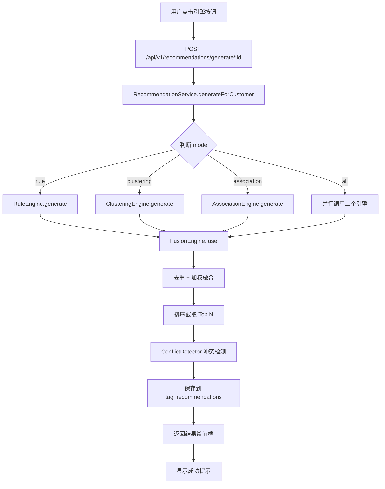
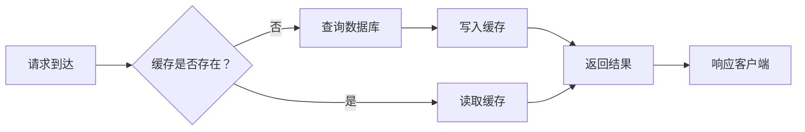
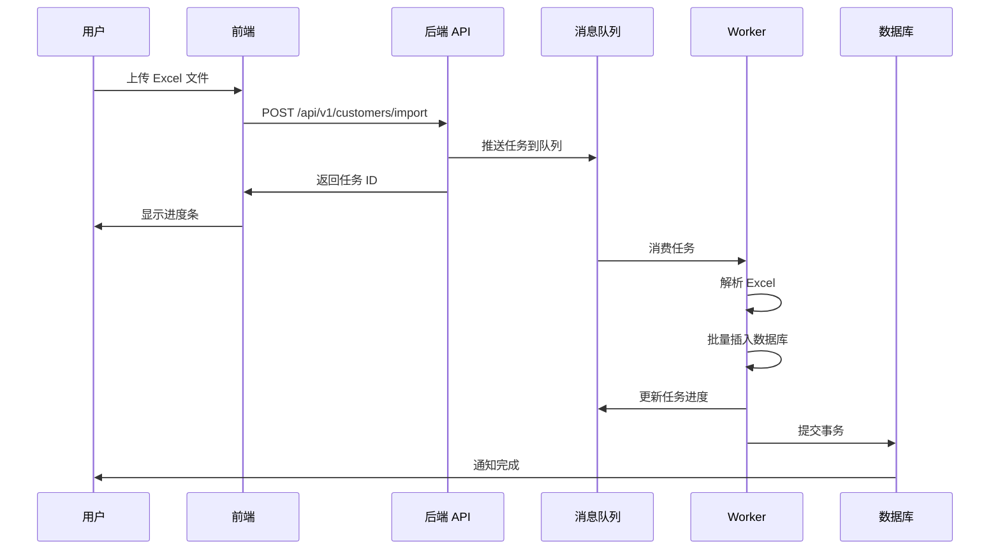

# 设计规范 (Design Guidelines)

**版本**: v1.0  
**生效日期**: 2026-03-30  
**适用范围**: customer-label 项目全体设计与开发人员

---

## 🏗️ 一、架构决策记录 (ADR)

### ADR-001: 选择 NestJS 作为后端框架

**日期**: 2026-03-25  
**状态**: 已采纳  
**决策**: 采用 NestJS + TypeScript 作为后端技术栈

#### 背景
项目需要一个结构化、可扩展的后端框架，支持模块化开发和依赖注入。

#### 决策驱动因素
- ✅ **依赖注入**: 便于实现缓存装饰器、拦截器等 AOP 功能
- ✅ **装饰器语法**: 适合声明式编程（如 `@Cacheable`、`@UseGuards`）
- ✅ **Angular 风格**: 组织结构清晰，易于团队协作
- ✅ **TypeScript 原生支持**: 类型安全，减少运行时错误
- ✅ **生态系统**: 丰富的官方模块（TypeORM、Redis、JWT 等）

#### 替代方案
| 方案 | 优点 | 缺点 | 评分 |
|------|------|------|------|
| **NestJS** | 结构化好、生态丰富 | 学习曲线略陡 | ⭐⭐⭐⭐⭐ |
| Express.js | 轻量灵活、文档丰富 | 缺少规范、易混乱 | ⭐⭐⭐ |
| Fastify | 性能最优 | 生态较小、插件少 | ⭐⭐⭐⭐ |
| Koa | 简洁优雅 | 社区活跃度低 | ⭐⭐⭐ |

#### 影响
- 所有后端代码使用 TypeScript 编写
- 遵循 NestJS 模块组织模式
- 使用装饰器和依赖注入作为核心范式

---

### ADR-002: 选择 PostgreSQL 作为主数据库

**日期**: 2026-03-25  
**状态**: 已采纳  
**决策**: 采用 PostgreSQL 14+ 作为关系型数据库

#### 决策驱动因素
- ✅ **JSONB 支持**: 可存储半结构化数据（如标签属性）
- ✅ **窗口函数**: 便于实现 RFM 五分位排名
- ✅ **扩展性强**: 支持自定义函数和索引
- ✅ **ACID 兼容**: 保证事务安全性

#### 替代方案
| 方案 | 优点 | 缺点 | 评分 |
|------|------|------|------|
| **PostgreSQL** | 功能强大、扩展性好 | 内存占用略高 | ⭐⭐⭐⭐⭐ |
| MySQL | 普及度高、文档丰富 | JSON 支持较弱 | ⭐⭐⭐⭐ |
| MongoDB | 灵活 schema | 事务支持晚 | ⭐⭐⭐ |

---

### ADR-003: 采用 Redis 作为缓存层

**日期**: 2026-03-26  
**状态**: 已采纳  
**决策**: 使用 Redis 6+ 实现应用级缓存

#### 决策驱动因素
- ✅ **高性能**: 单线程模型，读写速度极快
- ✅ **数据结构丰富**: String、Hash、Set、Sorted Set
- ✅ **持久化**: RDB+AOF 双保障
- ✅ **发布订阅**: 支持未来事件驱动架构

#### 使用场景
1. **热点数据缓存**: 客户详情、配置信息
2. **会话管理**: JWT Token 黑名单
3. **分布式锁**: 防止缓存击穿
4. **计数器**: 访问统计、推荐次数

---

### ADR-004: 微服务 vs 单体架构选择

**日期**: 2026-03-27  
**状态**: 已采纳  
**决策**: 初期采用模块化单体架构，预留微服务接口

#### 决策驱动因素
- ✅ **开发效率**: 单体架构部署简单，调试方便
- ✅ **团队规模**: 初期 3-5 人，单体足够支撑
- ✅ **业务复杂度**: 当前业务边界清晰，耦合度低
- ✅ **预留扩展**: 通过模块解耦，未来可平滑拆分

#### 微服务触发条件
当出现以下信号时考虑拆分：
- 团队规模 > 10 人
- 部署频率 > 每天 10 次
- 某个模块成为性能瓶颈
- 需要独立扩缩容

---

## 🎨 二、UI/UX 设计规范

### 2.1 色彩系统

基于 Ant Design 默认主题色：

```css
/* 主色调 */
--primary-color: #1890ff;        /* Ant Design Blue */
--primary-hover: #40a9ff;
--primary-active: #096dd9;

/* 功能色 */
--success-color: #52c41a;        /* 成功/安全 */
--warning-color: #faad14;        /* 警告/注意 */
--error-color: #f5222d;          /* 错误/危险 */
--info-color: #1890ff;           /* 信息/提示 */

/* 中性色 */
--text-primary: rgba(0, 0, 0, 0.85);
--text-secondary: rgba(0, 0, 0, 0.65);
--text-disabled: rgba(0, 0, 0, 0.25);
--border-color: #d9d9d9;
--background: #f5f5f5;

/* 客户等级色 */
--level-bronze: #cd7f32;         /* 青铜 */
--level-silver: #c0c0c0;         /* 白银 */
--level-gold: #ffd700;           /* 黄金 */
--level-platinum: #00ced1;       /* 白金 */
--level-diamond: #b9f2ff;        /* 钻石 */

/* 风险等级色 */
--risk-low: #52c41a;             /* 低风险 */
--risk-medium: #faad14;          /* 中风险 */
--risk-high: #f5222d;            /* 高风险 */
```

### 2.2 间距规范

基于 8px 栅格系统：

```css
/* 组件间距 */
--spacing-xs: 4px;               /* 超小间距 */
--spacing-sm: 8px;               /* 小间距 */
--spacing-md: 16px;              /* 中间距 */
--spacing-lg: 24px;              /* 大间距 */
--spacing-xl: 32px;              /* 超大间距 */
--spacing-xxl: 48px;             /* 特大间距 */

/* 使用示例 */
.card {
  padding: var(--spacing-md);    /* 16px */
}

.button-group {
  gap: var(--spacing-sm);        /* 8px */
}

.section {
  margin-bottom: var(--spacing-lg);  /* 24px */
}
```

### 2.3 字体规范

```css
/* 字体家族 */
--font-family: -apple-system, BlinkMacSystemFont, 'Segoe UI', 'PingFang SC',
               'Hiragino Sans GB', 'Microsoft YaHei', sans-serif;

/* 字体大小 */
--font-size-xs: 12px;            /* 辅助文字 */
--font-size-sm: 14px;            /* 正文/按钮 */
--font-size-md: 16px;            /* 小标题 */
--font-size-lg: 20px;            /* 中标题 */
--font-size-xl: 24px;            /* 大标题 */

/* 字重 */
--font-weight-normal: 400;
--font-weight-medium: 500;
--font-weight-bold: 600;
```

### 2.4 圆角规范

```css
--border-radius-sm: 2px;         /* 小圆角 */
--border-radius-md: 4px;         /* 默认圆角 */
--border-radius-lg: 8px;         /* 大圆角 */
--border-radius-full: 9999px;    /* 完全圆角 */
```

---

## 🧩 三、设计模式应用

### 3.1 策略模式 (Strategy Pattern)

**场景**: 多推荐引擎可切换

```typescript
// 抽象策略
interface RecommendationStrategy {
  generateRecommendations(
    data: CustomerData
  ): Promise<CreateRecommendationDto[]>;
}

// 具体策略
@Injectable()
export class RuleEngineService implements RecommendationStrategy {
  async generateRecommendations(data: CustomerData) {
    // 基于规则表达式匹配
  }
}

@Injectable()
export class ClusteringEngineService implements RecommendationStrategy {
  async generateRecommendations(data: CustomerData) {
    // K-Means 聚类分析
  }
}

@Injectable()
export class AssociationEngineService implements RecommendationStrategy {
  async generateRecommendations(data: CustomerData) {
    // Apriori 关联规则挖掘
  }
}

// 上下文（推荐服务）
@Injectable()
export class RecommendationService {
  constructor(
    private readonly ruleEngine: RuleEngineService,
    private readonly clusteringEngine: ClusteringEngineService,
    private readonly associationEngine: AssociationEngineService,
  ) {}

  async generateForCustomer(customerId: number, options: RecommendOptions) {
    const strategies = [];
    
    if (options.mode === 'rule' || options.mode === 'all') {
      strategies.push(this.ruleEngine);
    }
    if (options.mode === 'clustering' || options.mode === 'all') {
      strategies.push(this.clusteringEngine);
    }
    if (options.mode === 'association' || options.mode === 'all') {
      strategies.push(this.associationEngine);
    }

    // 并行执行所有选中的策略
    const results = await Promise.all(
      strategies.map(strategy => 
        strategy.generateRecommendations(customerData)
      )
    );

    return results.flat();
  }
}
```

**优势**:
- ✅ 开闭原则：新增引擎无需修改现有代码
- ✅ 单一职责：每个引擎专注于自己的算法
- ✅ 可测试性：各引擎独立 Mock 测试

---

### 3.2 工厂模式 (Factory Pattern)

**场景**: CacheService 创建缓存实例

```typescript
@Injectable()
export class CacheService {
  /**
   * 智能缓存工厂方法
   * 缓存未命中时自动执行 getter 并回填
   */
  async getOrSet<T>(
    key: string,
    getter: () => Promise<T>,
    options?: { ttl?: number; prefix?: string }
  ): Promise<T> {
    const cacheKey = `${options?.prefix || ''}${key}`;
    
    // 尝试从缓存获取
    const cached = await this.get<T>(cacheKey);
    if (cached !== null) {
      return cached;
    }

    // 缓存未命中，执行 getter
    const result = await getter();
    
    // 回填缓存
    await this.set(cacheKey, result, { ttl: options?.ttl });
    
    return result;
  }

  /**
   * 批量设置工厂
   */
  async mset(entries: Array<{ key: string; value: any; ttl?: number }>) {
    const pipeline = this.redisClient.pipeline();
    
    for (const entry of entries) {
      pipeline.set(entry.key, JSON.stringify(entry.value));
      if (entry.ttl) {
        pipeline.expire(entry.key, entry.ttl);
      }
    }
    
    await pipeline.exec();
  }
}
```

**使用示例**:
```typescript
// 使用工厂方法简化调用
async getCustomerStatistics(): Promise<Stats> {
  return this.cacheService.getOrSet(
    'stats:customer:daily',
    async () => {
      // 耗时计算逻辑
      return this.calculateStatistics();
    },
    { ttl: 86400 }  // 24 小时
  );
}
```

---

### 3.3 装饰器模式 (Decorator Pattern)

**场景**: @Cacheable 缓存装饰器

```typescript
/**
 * 缓存装饰器
 * 自动处理方法结果的缓存与读取
 */
export function Cacheable(options: {
  ttl: number;
  prefix?: string;
  keyGenerator?: (args: any[]) => string;
}): MethodDecorator {
  return (target, propertyKey, descriptor) => {
    const originalMethod = descriptor.value;

    descriptor.value = async function (...args: any[]) {
      const cacheService = this.cacheService as CacheService;
      
      // 生成缓存键
      const key = options.keyGenerator 
        ? options.keyGenerator(args)
        : `${propertyKey.toString()}:${JSON.stringify(args)}`;
      
      const cacheKey = `${options.prefix || ''}${key}`;

      // 尝试从缓存读取
      const cached = await cacheService.get(cacheKey);
      if (cached !== null) {
        return cached;
      }

      // 执行原方法
      const result = await originalMethod.apply(this, args);

      // 写入缓存
      await cacheService.set(cacheKey, result, { ttl: options.ttl });

      return result;
    };

    return descriptor;
  };
}

// 使用示例
@Injectable()
export class CustomerService {
  constructor(private cacheService: CacheService) {}

  @Cacheable({ ttl: 3600, prefix: 'customer:' })
  async findOne(id: number): Promise<Customer> {
    return this.repository.findOne({ where: { id } });
  }
}
```

---

### 3.4 观察者模式 (Observer Pattern)

**场景**: 推荐结果冲突检测

```typescript
// 被观察者
class ConflictDetector extends Subject<ConflictEvent> {
  detect(conflicts: RecommendationConflict[]): void {
    conflicts.forEach(conflict => {
      this.notifyObservers(conflict);
    });
  }
}

// 观察者
class ConflictLogger implements Observer<ConflictEvent> {
  update(event: ConflictEvent): void {
    console.log(`检测到冲突：${event.type}`, event.details);
  }
}

class ConflictResolver implements Observer<ConflictEvent> {
  update(event: ConflictEvent): void {
    // 自动解决冲突逻辑
    this.resolve(event);
  }
}

// 使用
const detector = new ConflictDetector();
detector.addObserver(new ConflictLogger());
detector.addObserver(new ConflictResolver());
detector.detect(conflicts);
```

---

### 3.5 模板方法模式 (Template Method Pattern)

**场景**: 推荐引擎执行流程

```typescript
// 抽象模板
abstract class BaseRecommendationEngine {
  /**
   * 模板方法：定义引擎执行流程
   */
  async execute(data: CustomerData): Promise<CreateRecommendationDto[]> {
    // 1. 数据验证
    this.validateData(data);
    
    // 2. 特征提取
    const features = this.extractFeatures(data);
    
    // 3. 核心算法（子类实现）
    const rawResults = await this.runAlgorithm(features);
    
    // 4. 后处理
    const processedResults = this.postProcess(rawResults);
    
    // 5. 质量过滤
    const filteredResults = this.filterByQuality(processedResults);
    
    return filteredResults;
  }

  // 钩子方法（可选覆盖）
  protected validateData(data: CustomerData): void {
    // 默认实现
  }

  // 抽象方法（必须实现）
  protected abstract extractFeatures(data: CustomerData): any;
  protected abstract runAlgorithm(features: any): Promise<any[]>;
  protected abstract postProcess(results: any[]): any[];
  protected filterByQuality(results: any[]): any[] {
    return results.filter(r => r.confidence >= 0.5);
  }
}

// 具体实现
@Injectable()
export class ClusteringEngineService extends BaseRecommendationEngine {
  protected extractFeatures(data: CustomerData): number[] {
    return [
      data.totalAssets,
      data.transactionCount,
      data.avgTransactionAmount,
      // ...
    ];
  }

  protected async runAlgorithm(features: number[]): Promise<any[]> {
    // K-Means 聚类实现
  }

  protected postProcess(results: any[]): any[] {
    // 簇画像分析
  }
}
```

---

## 📐 四、API 设计规范

### 4.1 RESTful 路由规范

```typescript
// ✅ 资源命名使用复数名词
@Controller('api/v1/customers')
export class CustomerController {
  
  // GET /api/v1/customers
  @Get()
  async findAll(@Query() query: QueryDto) { }
  
  // GET /api/v1/customers/:id
  @Get(':id')
  async findOne(@Param('id') id: number) { }
  
  // POST /api/v1/customers
  @Post()
  async create(@Body() dto: CreateCustomerDto) { }
  
  // PUT /api/v1/customers/:id
  @Put(':id')
  async update(
    @Param('id') id: number,
    @Body() dto: UpdateCustomerDto
  ) { }
  
  // DELETE /api/v1/customers/:id
  @Delete(':id')
  async remove(@Param('id') id: number) { }
  
  // POST /api/v1/recommendations/generate/:customerId
  @Post('recommendations/generate/:customerId')
  async generateRecommendations(
    @Param('customerId') customerId: number,
    @Body() options: RecommendOptions
  ) { }
}
```

### 4.2 响应格式规范

```typescript
// 统一成功响应
{
  "success": true,
  "data": { /* 实际数据 */ },
  "message": "操作成功",
  "timestamp": "2026-03-30T12:00:00.000Z"
}

// 分页响应
{
  "success": true,
  "data": [ /* 列表数据 */ ],
  "pagination": {
    "total": 100,
    "page": 1,
    "limit": 10,
    "totalPages": 10
  }
}

// 错误响应
{
  "success": false,
  "error": {
    "code": "CUSTOMER_NOT_FOUND",
    "message": "客户不存在",
    "details": {
      "customerId": 123
    }
  },
  "timestamp": "2026-03-30T12:00:00.000Z"
}
```

### 4.3 HTTP 状态码使用

| 状态码 | 场景 | 示例 |
|--------|------|------|
| `200 OK` | GET/PUT/PATCH 成功 | 查询客户成功 |
| `201 Created` | POST 创建成功 | 创建新客户 |
| `204 No Content` | DELETE 成功 | 删除客户 |
| `400 Bad Request` | 请求参数错误 | 验证失败 |
| `401 Unauthorized` | 未认证 | JWT 过期 |
| `403 Forbidden` | 无权限 | 普通用户访问管理员接口 |
| `404 Not Found` | 资源不存在 | 客户 ID 不存在 |
| `409 Conflict` | 资源冲突 | 邮箱已存在 |
| `422 Unprocessable Entity` | 业务验证失败 | 余额不足 |
| `500 Internal Server Error` | 服务器内部错误 | 数据库异常 |

---

## 🔀 五、数据流设计

### 5.1 推荐引擎数据流



### 5.2 缓存数据流



### 5.3 批量导入数据流



---

## 🎯 六、前端组件设计规范

### 6.1 组件分类

```typescript
/**
 * 页面组件 (Pages)
 * 完整业务页面，包含数据获取和路由
 */
// ✅ 示例：客户列表页
export default function CustomerList() {
  const [customers, setCustomers] = useState([]);
  
  useEffect(() => {
    // 数据获取
    customerService.getList().then(setCustomers);
  }, []);
  
  return <div>{/* 页面内容 */}</div>;
}

/**
 * 通用组件 (Components)
 * 可复用的 UI 组件，通过 props 接收数据
 */
// ✅ 示例：客户卡片
interface CustomerCardProps {
  customer: Customer;
  onEdit?: (id: number) => void;
  onDelete?: (id: number) => void;
}

export function CustomerCard({ customer, onEdit, onDelete }: CustomerCardProps) {
  return (
    <Card>
      <h3>{customer.name}</h3>
      <p>等级：{customer.level}</p>
      <Space>
        <Button onClick={() => onEdit?.(customer.id)}>编辑</Button>
        <Button onClick={() => onDelete?.(customer.id)}>删除</Button>
      </Space>
    </Card>
  );
}
```

### 6.2 Props 命名规范

```typescript
// ✅ 事件处理函数以 on 开头
interface ButtonProps {
  onClick?: () => void;
  onChange?: (value: string) => void;
  onSubmit?: (data: FormData) => void;
}

// ✅ 布尔值以 is/has/can 等前缀
interface UserProps {
  isAdmin?: boolean;
  isActive?: boolean;
  hasPermission?: boolean;
  canEdit?: boolean;
}

// ✅ 渲染回调以 render 开头
interface TableProps {
  renderItem?: (item: any) => React.ReactNode;
  renderHeader?: () => React.ReactNode;
}
```

### 6.3 Hooks 使用规范

```typescript
// ✅ 自定义 Hooks 抽取复用逻辑
function useCustomers() {
  const [customers, setCustomers] = useState([]);
  const [loading, setLoading] = useState(false);
  
  const loadCustomers = async () => {
    setLoading(true);
    try {
      const data = await customerService.getList();
      setCustomers(data);
    } finally {
      setLoading(false);
    }
  };
  
  useEffect(() => {
    loadCustomers();
  }, []);
  
  return { customers, loading, refresh: loadCustomers };
}

// 使用
export default function CustomerList() {
  const { customers, loading, refresh } = useCustomers();
  
  return <div>{/* ... */}</div>;
}
```

---

## 📊 七、数据库设计规范

### 7.1 表命名规范

```sql
-- ✅ 使用小写 + 下划线
CREATE TABLE customers (
  id SERIAL PRIMARY KEY,
  name VARCHAR(100) NOT NULL
);

-- ✅ 关联表使用复数 + _to_ + 复数
CREATE TABLE customer_tags (
  customer_id INT,
  tag_id INT,
  PRIMARY KEY (customer_id, tag_id)
);

-- ✅ 配置表使用 _configs 后缀
CREATE TABLE clustering_configs (
  id SERIAL PRIMARY KEY,
  k_value INT DEFAULT 5
);
```

### 7.2 字段命名规范

```sql
-- ✅ 主键统一使用 id
CREATE TABLE users (
  id SERIAL PRIMARY KEY  -- 不是 user_id
);

-- ✅ 外键使用 {表名}_id
CREATE TABLE orders (
  customer_id INT REFERENCES customers(id),  -- 不是 cid
  product_id INT REFERENCES products(id)
);

-- ✅ 布尔值使用 is_/has_/can_ 前缀
ALTER TABLE customers ADD COLUMN is_active BOOLEAN DEFAULT true;
ALTER TABLE customers ADD COLUMN has_vip_card BOOLEAN DEFAULT false;

-- ✅ 金额使用 DECIMAL(15,2)
CREATE TABLE orders (
  total_amount DECIMAL(15,2) NOT NULL
);

-- ✅ 时间戳使用 TIMESTAMP
CREATE TABLE customers ADD COLUMN created_at TIMESTAMP DEFAULT CURRENT_TIMESTAMP;
```

### 7.3 索引设计规范

```sql
-- ✅ 为常用查询字段创建索引
CREATE INDEX idx_customers_level ON customers(level);
CREATE INDEX idx_customers_city ON customers(city);

-- ✅ 为外键创建索引
CREATE INDEX idx_orders_customer_id ON orders(customer_id);

-- ✅ 复合索引考虑最左前缀原则
CREATE INDEX idx_customers_level_assets ON customers(level, total_assets);
-- 查询 WHERE level = 'GOLD' AND total_assets > 10000 可使用索引
-- 查询 WHERE total_assets > 10000 无法使用该索引

-- ✅ 唯一索引保证业务唯一性
CREATE UNIQUE INDEX idx_users_email ON users(email);
```

---

## 🔄 八、重构与演进

### 8.1 技术债务识别

以下情况应记录并安排重构：

```markdown
## 技术债务清单

### TD-001: 过度耦合的模块
**位置**: `recommendation.service.ts`  
**问题**: 单个文件超过 1000 行，包含多个职责  
**影响**: 难以维护和测试  
**优先级**: P1  
**解决方案**: 拆分为协调服务和引擎服务

### TD-002: 硬编码的配置值
**位置**: 多处  
**问题**: TTL、阈值等硬编码  
**影响**: 修改需重新编译  
**优先级**: P2  
**解决方案**: 移至配置文件或环境变量
```

### 8.2 架构演进路线

```
Phase 1 (v1.0): 模块化单体架构 ✅
└─ 清晰的模块边界
└─ 依赖注入解耦
└─ 统一的缓存层

Phase 2 (v2.0): 服务化拆分
└─ 独立的推荐服务
└─ 独立的客户数据服务
└─ 通过 gRPC/RPC 通信

Phase 3 (v3.0): 微服务架构
└─ 完整的服务网格
└─ 容器化部署
└─ 自动扩缩容
```

---

## 📚 九、参考资源

### 9.1 设计模式

- 《设计模式：可复用面向对象软件的基础》
- [Refactoring.Guru](https://refactoring.guru/)
- [NestJS 最佳实践](https://docs.nestjs.com/techniques/performance)

### 9.2 UI/UX

- [Ant Design 设计规范](https://ant.design/docs/spec/introduce-cn)
- [Material Design Guidelines](https://material.io/design)

### 9.3 架构

- [Clean Architecture](https://blog.cleancoder.com/uncle-bob/2012/08/13/the-clean-architecture.html)
- [12-Factor App](https://12factor.net/)

---

**文档版本**: v1.0  
**编制日期**: 2026-03-30  
**审核人**: [待填写]  
**批准人**: [待填写]

**© 2026 客户标签推荐系统项目组 版权所有**
